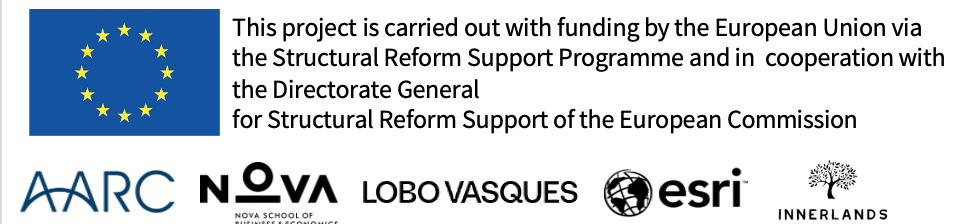

# Introdução ao R (e ao Tidyverse)

_Luís Teles Morais - Nova SBE_

Este repositório contém materiais de aprendizagem em português sobre o software R e a sua utilização para tratamento de dados, análise estatística e modelação econométrica.

Preparado para a Autoridade Tributária e Aduaneira no âmbito do projeto REFORM/SC2022/126, _Designing a new valuation model for rural properties in portugal_, Deliverable 4 - Training in R.

### Conteúdos

_Update: 14/06/2023 _

- "Slides" do módulo 2.2
- Códigos R utilizados em aula

_Update: 05/05/2023 _

- "Slides" dos módulos 1. e 2.1.
- Códigos R utilizados em aula
- Exercícios adicionais

### Fontes e disclaimers

Os materiais baseiam-se sobretudo em versões traduzidas e adaptadas de partes dos seguintes cursos:

- [Data Science in a Box](https://datasciencebox.org)
- [Remaster the Tidyverse](https://github.com/rstudio-education/remaster-the-tidyverse)

Licença: [CC BY-SA 4.0]("https://creativecommons.org/licenses/by-sa/4.0/")

